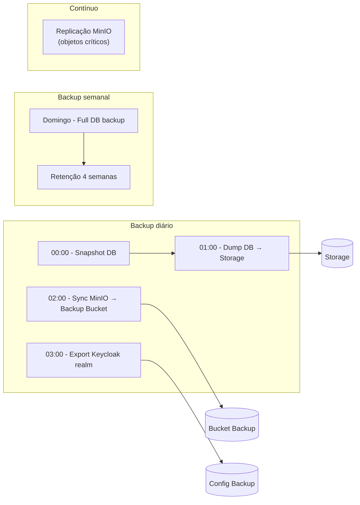
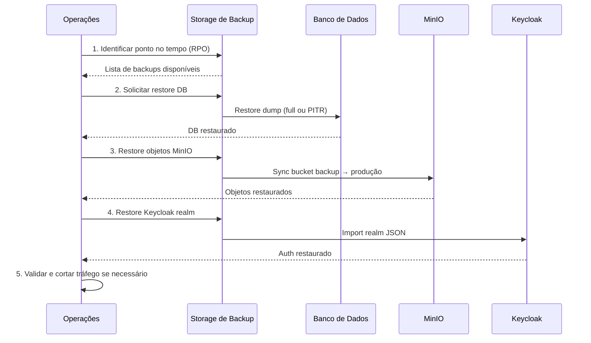

# Diagramas de Infraestrutura de Backup

## 1. Visão geral da infraestrutura com fluxos de backup

```mermaid
flowchart TB
    subgraph clientes["Clientes"]
        PWA["PWA (Browser)"]
    end

    subgraph producao["Ambiente de Produção"]
        LB["Load Balancer"]
        API["API Backend"]
        DB[( "Banco de Dados\n(PostgreSQL/MySQL)" )]
        Keycloak["Keycloak\n(Auth)"]
        MinIO["MinIO / S3\n(Objetos/Fotos)"]
    end

    subgraph backup["Estratégia de Backup"]
        BKP_DB["Backup DB\n(diário + incremental)"]
        BKP_MINIO["Backup MinIO\n(sync/replica)"]
        BKP_KEYCLOAK["Backup Keycloak\n(realm/config)"]
        BKP_API["Backup configs API\n(env, secrets)"]
    end

    subgraph armazenamento_backup["Armazenamento de Backup"]
        STORAGE_DB[("Storage Backup DB\n(retenção 30d)")]
        STORAGE_OBJ[("Storage Backup Objetos\n(cross-region)")]
        STORAGE_CFG[("Storage Configs\n(criptografado)")]
    end

    subgraph dr["Disaster Recovery (opcional)"]
        DR_SITE["Site DR\n(replicação)"]
        RESTORE["Processo de Restore"]
    end

    PWA --> LB
    LB --> API
    API --> DB
    API --> Keycloak
    API --> MinIO

    DB --> BKP_DB
    MinIO --> BKP_MINIO
    Keycloak --> BKP_KEYCLOAK
    API --> BKP_API

    BKP_DB --> STORAGE_DB
    BKP_MINIO --> STORAGE_OBJ
    BKP_KEYCLOAK --> STORAGE_CFG
    BKP_API --> STORAGE_CFG

    STORAGE_DB --> RESTORE
    STORAGE_OBJ --> RESTORE
    STORAGE_CFG --> RESTORE
    RESTORE --> DR_SITE
```

---

## 2. Fluxo temporal de backup (cronograma)



---

## 3. Componentes de backup (detalhe)

```mermaid
flowchart TB
    subgraph origens["Origens"]
        DB[( "Banco de Dados" )]
        MINIO["MinIO"]
        KC["Keycloak"]
        SECRETS["Secrets / .env"]
    end

    subgraph jobs["Jobs de Backup"]
        J1["Job 1: pg_dump / mysqldump"]
        J2["Job 2: mc mirror ou rclone"]
        J3["Job 3: export realm JSON"]
        J4["Job 4: backup env (criptografado)"]
    end

    subgraph destinos["Destinos"]
        NFS[("NFS/SAN")]
        S3_EXT[("S3 externo\nou outro MinIO")]
        VAULT[("Vault / KMS\n(secrets)")]
    end

    subgraph retencao["Política de retenção"]
        R1["DB: 7 diários, 4 semanais, 12 mensais"]
        R2["Objetos: 30 dias ou versionamento"]
        R3["Configs: 90 dias"]
    end

    DB --> J1
    MINIO --> J2
    KC --> J3
    SECRETS --> J4

    J1 --> NFS
    J2 --> S3_EXT
    J3 --> NFS
    J4 --> VAULT

    NFS --> R1
    S3_EXT --> R2
    VAULT --> R3
```

---

## 4. Restore (recuperação)



---

## 5. Visão simplificada (uma página)

```mermaid
flowchart LR
    subgraph prod["Produção"]
        API["API"]
        DB[( "DB" )]
        KC["Keycloak"]
        M["MinIO"]
    end

    subgraph bkp["Backup"]
        B1["DB backup"]
        B2["Object backup"]
        B3["Config backup"]
    end

    subgraph store["Armazenamento"]
        S1[("Backup DB")]
        S2[("Backup Objetos")]
        S3[("Configs")]
    end

    DB --> B1 --> S1
    M --> B2 --> S2
    KC --> B3 --> S3
    API -.-> B3
```

---

## Como usar

- Cole qualquer bloco em [Mermaid Live Editor](https://mermaid.live) para editar ou exportar (PNG/SVG).
- No GitHub/GitLab, o Mermaid é renderizado automaticamente em arquivos `.md`.
- Para documentação interna, use estes diagramas em um `docs/` ou no README.

## Legenda

| Símbolo   | Significado        |
|----------|--------------------|
| `[( )]`  | Banco / dados      |
| `[("")]` | Storage / arquivos |
| Setas →  | Fluxo de dados     |
| `-.->`   | Fluxo opcional     |
